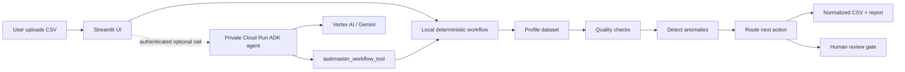

# SignalSweep architecture

SignalSweep keeps deterministic data operations local and observable. The
optional cloud path uses Google ADK on a private Cloud Run service; the Agent
must call the Taskmaster workflow tool, while the local workflow remains the
source of truth for the displayed result.

## Runtime boundaries

- **Streamlit + local Python tools:** accepts the CSV and performs the
  reproducible profile, quality, anomaly, routing, export, and reporting steps.
- **Taskmaster workflow:** records the plan, tool execution, findings, and
  review decision in an append-only trace.
- **Cloud Run + Google ADK:** provides the optional authenticated Agent hook
  used to demonstrate Gemini-based orchestration.
- **Human review:** material findings return `needs_review`; exact duplicate
  removal is never performed without an explicit approval and audit note.

## Failure behavior

If the authenticated Cloud Run call fails, the local deterministic workflow
still returns its result. The app does not silently overwrite business data.
